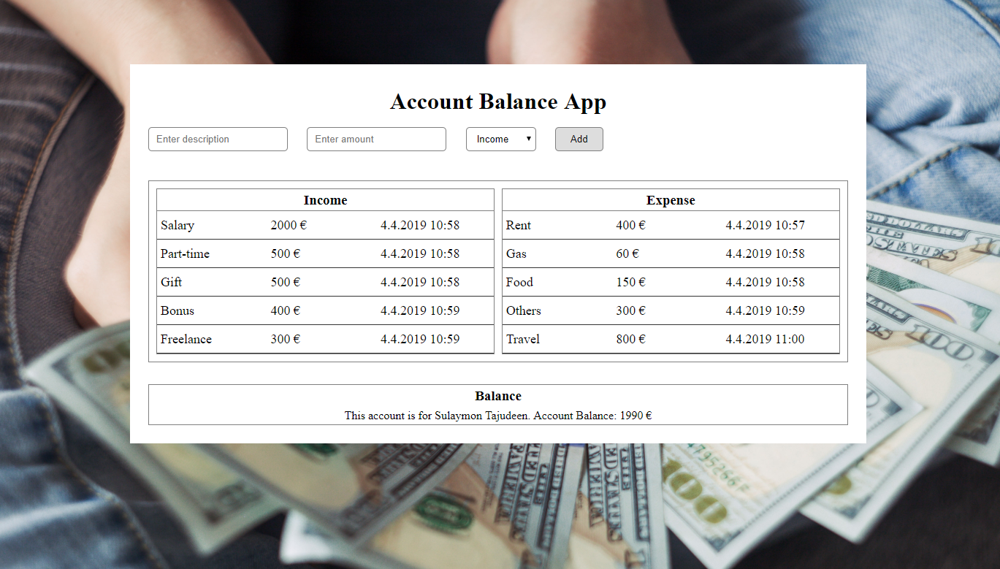

# Developing an interactive Country information finder App

This app is developed as part of my 6 months coding bootcamp at Integrify Helsinki. It was developed using native web browser local storage API, users can add income and expense and retrieve them after reloading the page or any other later time. At the end users can view that current balance. Additional features to be added include: edit, delete, clear items, login/logout functionalities. All functionalities was completed with ONLY Vanilla JavaScript. Happy Coding 😀.

## Demo

You can see the live demo of the App here:

[(https://github.com/Sulaymon333/Account-balance-app)](https://github.com/Sulaymon333/Account-balance-app)

# 

## Author

Sulaymon Tajudeen. [Learn More](https://sulaymontajudeen.com/)

## Technologies

- HTML
- CSS
- javaScript (Vanilla)

## License

This project is licensed under the MIT License - see the [LICENSE.md](./LICENSE.md) file for details.
